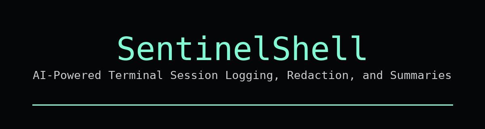

<p align="center">
  
</p>

# SentinelShell
AI-Powered Terminal Session Logging, Redaction, and Summaries

<p align="center">

  <!-- Your existing badges -->
  
  
  
  

  <br>

  <!-- GitHub dynamic badges -->
  
  
  
  
  

</p>


---

## What is SentinelShell?

SentinelShell is a terminal companion script that automatically:

- Records your terminal sessions
- Scrubs secrets using a redaction pipeline
- Generates AI summaries using the OpenAI CLI
- Allows replay, syncing, and autosync
- Builds a context profile for ChatGPT conversations

Ideal for:

- Pentesting
- CTF / TryHackMe / HackTheBox sessions
- Documentation and research
- Learning and workflow journaling

---

## Features

- Full terminal session recording (`script`)
- Intelligent secret redaction (passwords, tokens, API keys, bearer headers, etc.)
- OpenAI-generated summaries
- Session replay using `scriptreplay`
- Manual sync via OpenAI CLI
- Autosync every N minutes (optional)
- Profile generator for ChatGPT context
- Works with Bash, Zsh, and most Linux environments

---

## Installation

### 1. Clone repo

```
git clone https://github.com/necr0bot/SentinelShell.git
cd SentinelShell
```

### 2. Run installer

```
chmod +x install.sh
./install.sh
```

This will:

- Install pipx
- Install OpenAI CLI
- Install ripgrep (rg)
- Install gpt-session into /usr/local/bin

### 3. Set API key

```
export OPENAI_API_KEY="sk-xxxx"
echo 'export OPENAI_API_KEY="sk-xxxx"' >> ~/.zshrc
```
*Make sure you insert your API key here and don't just copypasta*

---

## Usage

### Start logging

```
gpt-session start
```

### Stop + summarize

```
gpt-session stop
```

This produces:

- <session>.log (raw)
- <session>.log.redacted
- <session>.log.summary.md

### Replay session

```
gpt-session replay
```

### Generate profile

```
gpt-session profile
```

### Sync to ChatGPT

```
gpt-session sync
```

### Autosync every N minutes

```
gpt-session autosync-on 30
gpt-session autosync-off
```

### Version

```
gpt-session --version
```

---

## Redaction

Secret detection removes:

- password = value
- passwd: value
- secret: value
- token: value
- Authorization: Bearer XXXXX
- api_key=XXXXXX

Redacted output is saved in ~/.gpt_sessions alongside raw logs.

---

## Documentation

See the docs/ directory:

- installation.md
- usage.md
- redaction.md
- autosync.md
- profile.md
- architecture.md

---

## Development

```
shellcheck gpt-session
```

---

## Contributing

See contributing.md

---

## Changelog

See changelog.md

---

## License

MIT License.

---

## Roadmap

- macOS installer
- pipx wrapper
- Homebrew formula
- AUR package
- Encrypted session storage
- Web dashboard
- Plugin system

---

## Maintainer

https://github.com/necr0bot
